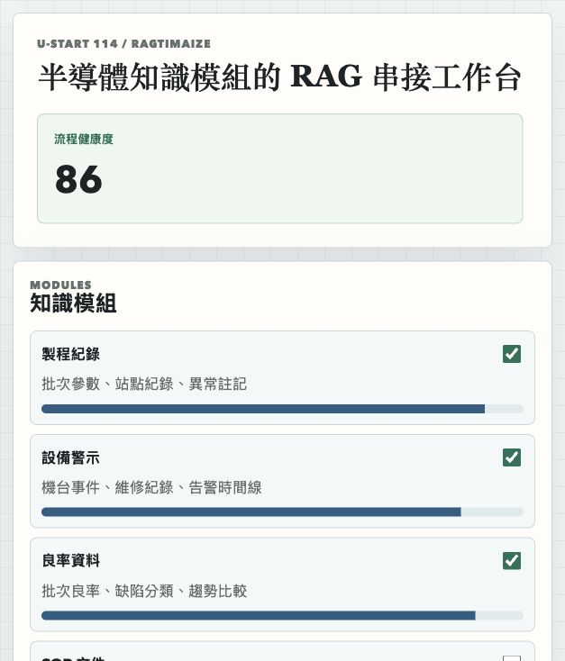
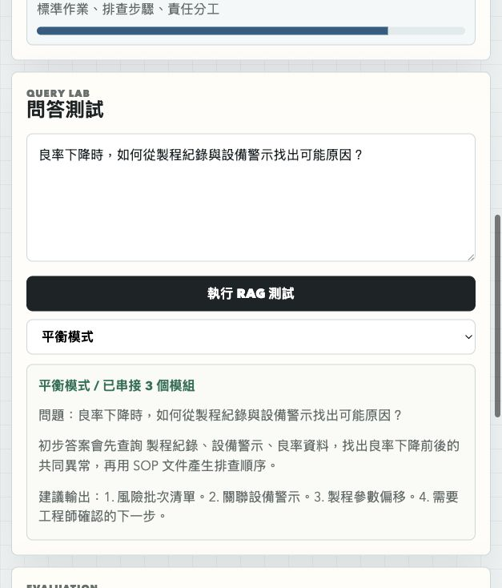

# RAGtimAIze 半導體智慧模組串接平台原型

## 快速看懂

- 線上 Demo：https://atlasforcn.github.io/startup-rag-semiconductor-workbench/
- 這個原型在做什麼：把 RAGtimAIze 做成半導體智慧模組串接與 RAG 工作台。
- 特色定位：特色是把文件、模組、查詢、引用與評估集中在半導體工程情境。
- 操作流程：選擇文件庫與半導體模組 → 提出問題並查看引用來源 → 比較回答品質、延遲與模組串接狀態

展開完整功能流程截圖

## 比賽來源

- 競賽：U-start 創新創業計畫
- 屆次：114 年度第二階段績優團隊
- 得獎作品：RAGtimAIze 半導體智慧模組串接平台
- 學校：逢甲大學
- 公司：夆泩數位發展有限公司
- 類別：製造技術
- 官方來源：https://ustart.yda.gov.tw/p/405-1000-2178,c147.php?Lang=zh-tw

## 核心概念

依公開名稱「半導體智慧模組串接平台」理解，本原型把作品概念實作為 RAG 工作台：選擇知識模組、串接製程/設備/良率/SOP 資料、測試問答品質，並用驗證案例檢查引用完整性與可操作性。

## 功能

- 啟用或停用知識模組
- 顯示模組品質與流程健康度
- 輸入半導體製程問題並產生 RAG 回覆草稿
- 切換平衡、嚴格引用、快速探索模式
- 追蹤引用完整性、異常歸因、回覆可操作性

## 聲明

本 repo 是依官方公開得獎名稱建立的概念原型，不代表原團隊授權產品，也未使用原團隊商標、素材或未公開資料。
